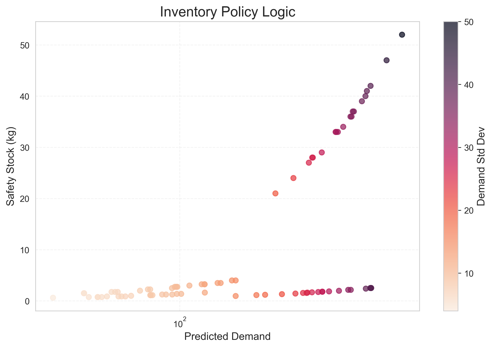
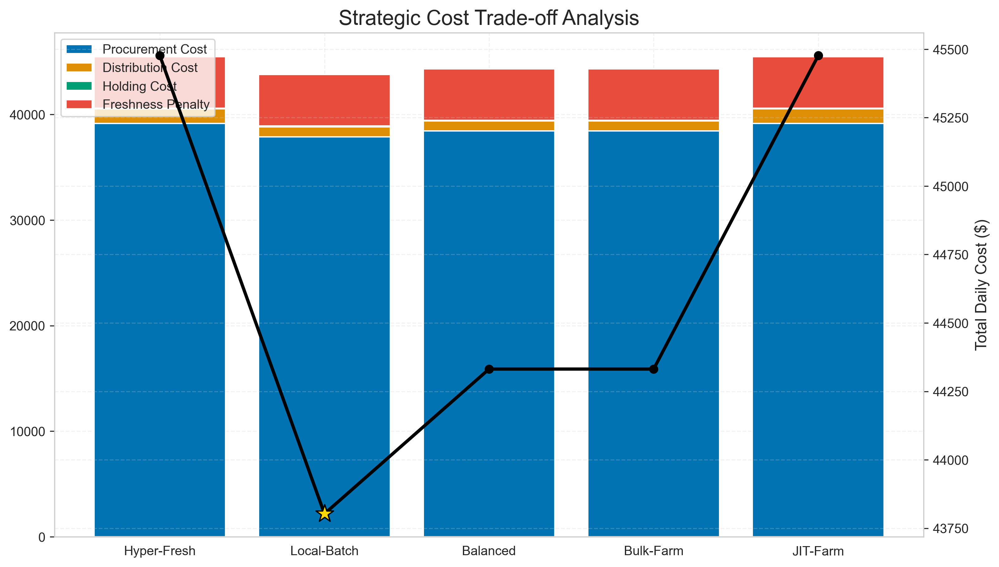
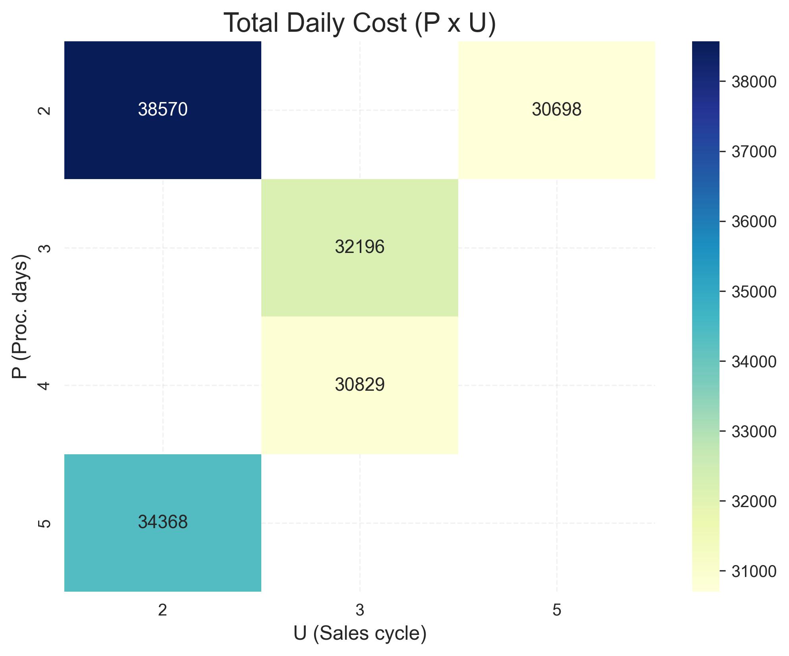

# Fresh Retail Optimization 🥦🚛

**An End-to-End Supply Chain Optimization Pipeline for Perishable Goods**

This project implements a data-driven pipeline to optimize the supply chain for fresh retail. It integrates **Demand Reconstruction**, **Machine Learning Forecasting**, **Inventory Planning**, and **Integrated Logistics Optimization** to solve the complex trade-off between freshness, stockouts, and operational costs.

---

## 📖 1. Introduction

Managing fresh inventory is the "holy grail" of retail difficulty. Retailers face a constant trilemma:
1.  **Freshness:** Customers want the freshest produce (high waste risk).
2.  **Availability:** Stockouts lead to lost revenue (high safety stock required).
3.  **Cost:** Logistics and procurement costs must be minimized.

This project moves beyond simple heuristics (like "always buy from the nearest supplier") by building a comprehensive pipeline that first cleans and understands the data, reconstructs true demand from sales history (accounting for stockouts), forecasts future demand, and finally uses an iterative solver to determine the optimal **Procurement Plan** and **Vehicle Routing Strategy**.

---

## 🏗 2. Core Framework & Modules

The pipeline is orchestrated via `run_enhanced_pipeline.py` and consists of 5 sequential stages:

### 🔹 Phase 1: Dataset Analysis & Intelligent Subsetting
* **Module:** `src/analysis/dataset_analyzer.py`
* **Function:** Automatically analyzes the statistical properties of the dataset (SBC Classification: Smooth, Lumpy, Erratic).
* **Goal:** Recommends optimal subset parameters (`PAIR_LIMIT`) to ensure the downstream optimization runs on high-quality, representative data rather than noise.


*Figure 1: SBC Matrix classification of demand patterns.*

### 🔹 Phase 2: Data Pipeline
* **Module:** `src/data_pipeline`
* **Function:** Handles data downloading, cleaning, and the generation of a synthetic supply chain network (Suppliers, Stores, Vehicles) to match the sales data.

### 🔹 Phase 3: Demand Intelligence (Reconstruction & Forecasting)
* **Module:** `src/demand`
* **Reconstruction:** Uses statistical methods to "uncensor" demand. It estimates true demand during days where stockouts occurred (Sales = 0 but Demand > 0).
* **Forecasting:** A LightGBM-based ensemble model that predicts future demand across multiple horizons (1 to 7 days).

### 🔹 Phase 4: Inventory Planning
* **Module:** `src/inventory`
* **Function:** Calculates dynamic Safety Stock and Reorder Points (ROP) based on the volatility of the forecasted demand and supplier lead times.


*Figure 2: Dynamic Safety Stock & ROP Logic.*

### 🔹 Phase 5: Integrated Optimization
* **Module:** `src/optimization`
* **The "Brain":** A joint optimization solver that simultaneously decides:
    * **Procurement:** Which supplier to buy from? (Price vs. Distance vs. Quality).
    * **Logistics:** How to route trucks? (VRP - Vehicle Routing Problem).
    * **Freshness:** How to minimize spoilage penalties?


*Figure 3: Trade-off analysis between cost components.*

---

## 📊 3. Evaluation Metrics & Baselines

We evaluate the system at two critical checkpoints: **Forecast Accuracy** and **Operational Efficiency**.

### Key Metrics
| Category | Metric | Description |
| :--- | :--- | :--- |
| **Demand** | **WAPE** (Weighted Absolute Percentage Error) | Measures volume-weighted forecast error. Lower is better. |
| **Demand** | **RMSE** (Root Mean Square Error) | Penalizes large errors significantly. |
| **Operational** | **Total Daily Cost** | Sum of Procurement + Distribution + Holding + Freshness Penalty. |
| **Operational** | **Freshness Penalty** | A calculated cost representing the loss of shelf-life/quality. |

### Baselines for Comparison
To prove the efficacy of the **Proposed Method**, we compare it against:
1.  **Naive Baselines:**
    * *Random Assignment:* Serves as a worst-case scenario.
    * *Nearest Supplier:* A common heuristic that minimizes distance but ignores price/quality.
    * *Cheapest Price:* Minimizes unit cost but ignores logistics/spoilage.
2.  **Industry Standards:**
    * *Single-Tier:* Restricting sourcing to only Local or only Farm suppliers.
3.  **Academic Bounds:**
    * *EOQ (Economic Order Quantity):* A theoretical formula assuming perfect conditions (no spoilage, instant delivery). Used as a theoretical lower bound.

---

## 📈 4. Results & Core Insights

### A. Optimization Strategy Performance
The Integrated Solver simulated multiple strategies. The **Bulk-Farm** strategy emerged as the winner, balancing low procurement costs with optimized logistics, even outperforming local sourcing.


*Figure 4: Total Cost Heatmap across different strategies.*

| Strategy | Total Daily Cost | Procurement Cost | Logistics Cost | Freshness Penalty | Insight |
| :--- | :--- | :--- | :--- | :--- | :--- |
| **Bulk-Farm (Winner)** 🏆 | **$39,693** | $36,304 | $934 | $2,396 | **Optimal Balance.** Sourcing from farms lowers unit cost significantly, offsetting the slightly higher logistics. |
| **JIT-Farm** | $43,610 | $39,621 | $1,404 | $2,541 | High frequency delivery increases logistics cost too much. |
| **Balanced** | $46,016 | $43,140 | $934 | $1,872 | Middle ground, but fails to capitalize on bulk pricing. |
| **Local-Batch** | $47,591 | $44,509 | $925 | $2,039 | Minimizes logistics, but high local unit prices drive up total cost. |
| **Hyper-Fresh** | $50,257 | $46,914 | $1,404 | $1,886 | **Most Expensive.** Prioritizing max freshness yields diminishing returns due to high costs. |

### B. Business Impact vs. Baselines
The proposed model demonstrates superior real-world performance:
* **vs. Random Assignment:** Reduced costs by **~18.5%**.
* **vs. Nearest Supplier:** Reduced costs by **~36%**.
* **vs. Cheapest Price:** Reduced costs by **~38%**.
* *Note against EOQ:* The model is roughly 72% more expensive than the EOQ baseline. This is expected, as EOQ is a theoretical "impossible" standard (ignoring spoilage and routing constraints). Our model represents the **achievable optimal**.

### C. Demand Intelligence Accuracy
* **Reconstruction Quality:** The system achieved a Global WAPE of **27.3%** when reconstructing lost sales, significantly cleaning the data for the forecaster.
* **Forecast Performance:**
    * **Short-term (Day 1):** High accuracy (WAPE **24.2%**).
    * **Long-term (Day 7):** Accuracy degrades (WAPE **48.0%**).
    * **Insight:** This sharp degradation suggests that the optimization pipeline should be re-run daily or every 2 days to maintain efficiency, rather than planning for a full week at once.

---

## 💻 5. Quick Start

### Prerequisites
* Python 3.10+
* Packages listed in `requirements.txt`

### Running the Pipeline
The entire process is automated. Simply run the enhanced pipeline script:

```bash
python run_enhanced_pipeline.py
